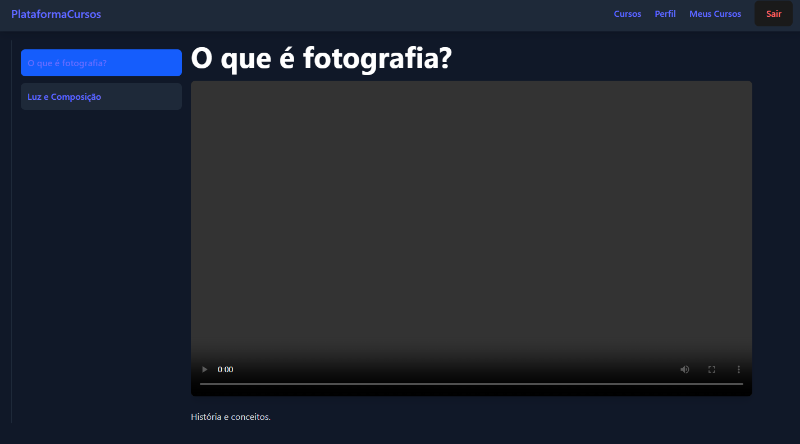
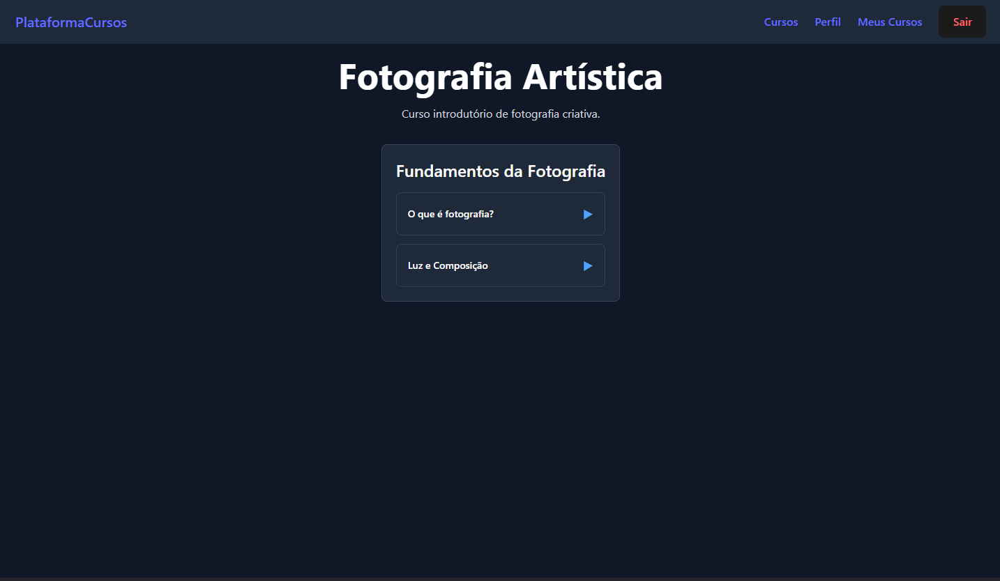
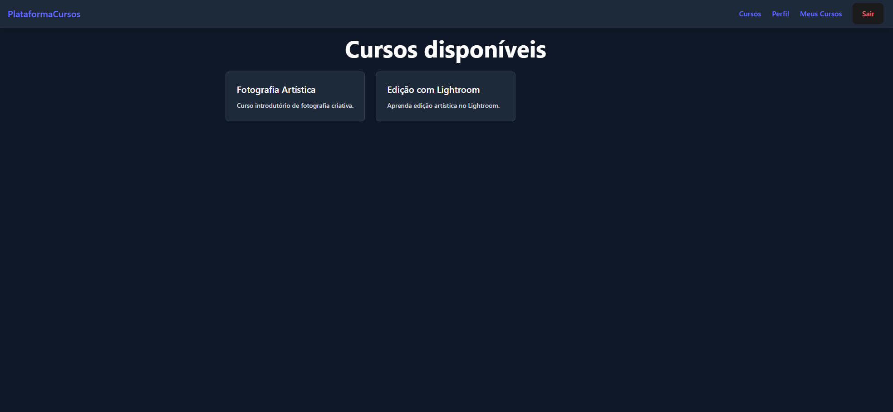
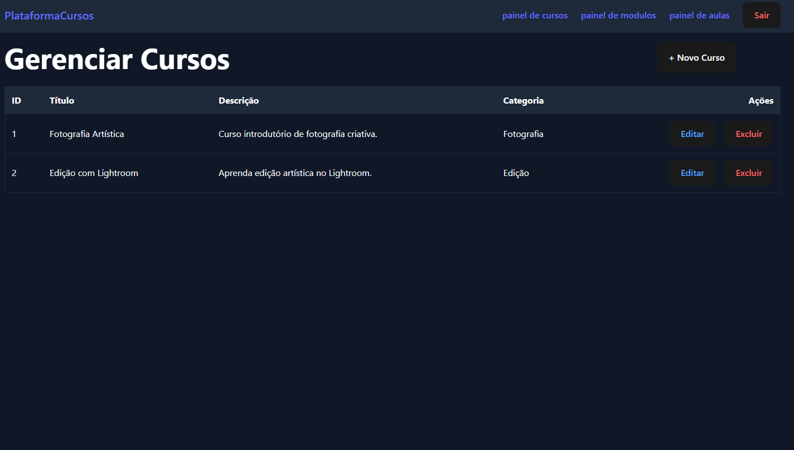
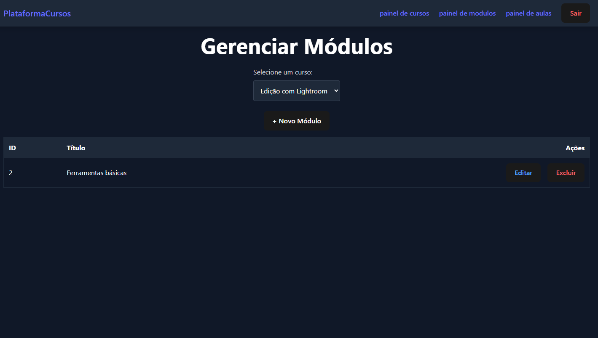
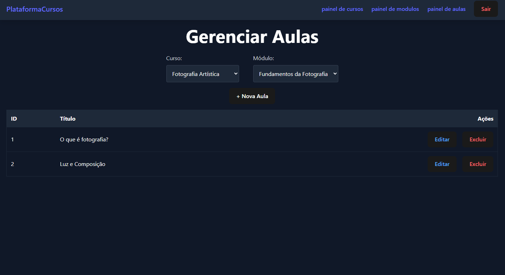

#  Plataforma de Cursos em Vídeo — Projeto Pessoal

Este projeto é uma plataforma de cursos estilo *Alura*, criada com o objetivo de estudar, praticar e aprofundar conhecimentos em**React + Tailwind** no frontend.  
A plataforma possui comunicação com Backend em Java, Telas de gestao administrativa, upload de vídeos e player com sidebar de aulas.
### Objetivos do Projeto
- Praticar **React**, rotas protegidas, contexto de autenticação e UI com Tailwind.
- Criar um ambiente realista de estudos full-stack.

##  Arquitetura Geral

### **Frontend — React + Vite**
- React 18
- React Router
- Context API para autenticação
- Tailwind CSS
- Player de vídeo com sidebar responsiva
- Área de administração completa
- Token armazenado no frontend (localStorage)
---

## Telas de usuario

### Tela de aula com sideBar com as outras aulas do mesmo modulo

### Tela de Modulos de um curso

### Tela de cursos 

## Telas de Admin

### tela de gestao de cursos

### tela de gestao dos modulos de um curso

### tela de gestao de aulas de um modulo

